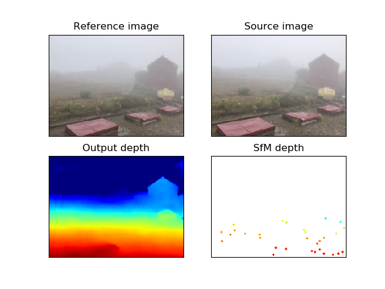

# Dehazing Cost Volume for Deep Multi-view Stereo in Scattering Media
This is the code of the extended version of our ACCV2020 paper "Dehazing Cost Volume for Deep Multi-view Stereo in Scattering Media".
If you use this code, please cite:

```
@article{fujimura20a,
	author = {Y. Fujimura and M. Sonogashira and M. Iiyama},
	title = {Dehazing Cost Volume for Deep Multi-view Stereo in Scattering Media},
	journal = {Asian Conference on Computer Vision (ACCV)},
	year = 2020
}

@article{fujimura20b,
	author = {Y. Fujimura and M. Sonogashira and M. Iiyama},
	title = {Dehazing Cost Volume for Deep Multi-view Stereo in Scattering Media with Scattering Parameters Estimation},
	journal = {TBA},
	year = 2020
}
```

## Download trained models
Our trained models can be downloaded as follows:

```bash download.sh ```

## Sample code
You can get sample result by

```python test.py --dcv_mvsnet_checkpoint model/dehazing_mvs_net.pth --airlight_checkpoint model/airlight_estimator.pth```

## Sample result


## Download video captured in foggy scene
We provided a video captured in actual foggy scenes. A sparse 3D point cloud and camera parameters of each frame were estimated by [COLMAP](https://colmap.github.io/) with sequential matching and default hyperparameters. At ```dataset_utils/colmap```, please run:

```bash download_shirouma2.sh```

We also provided a useful script that extracts camera parameters and sparse depth maps from COLMAP output.

```python save_sparse_depth.py -o shirouma2_sparse -c colmap/shirouma2``` 

Each data can be converted to a single npy file, which is loaded by a data loader.

```python create_dataset.py -i colmap/shirouma2/images -c shirouma2_sparse/ -o test_data -f 37```

## Use your own data
If you want to use your own data, please apply COLMAP to estimate camera parameters and a sparse 3D point cloud as preprocessing. Then you can use above scripts to make input data of the network.
